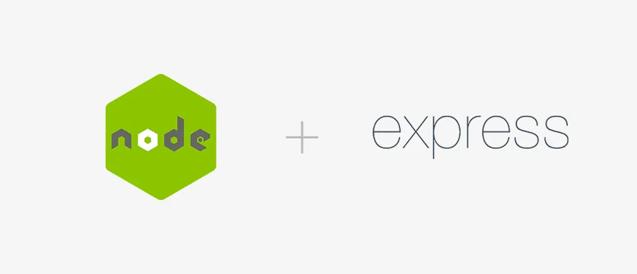

# CloudAPPi - REST API
REST API CRUD operations for user

## Node.js - API

## Getting started
### Prerequisites:
- Node.js
- Express
- Postgres

## Structure of the code ##
    Package
        - src
            - routes (ROUTES DEFINITION)
            - controllers (CONTROLLER, CONFIG FILES)
            - config (CONFIG FILES)
            - middlewares (HANDLE ERRORS)
            - schemas (OBJECT VALIDATIONS)
        - test (UNIT TESTS)

## Run the application
```
$ npm install
$ npm run dev
```

## Run the unit tests
```
$ npm run test
```

## Script to generate the database
```
https://github.com/hugojuradogarcia/api-code-challenge/blob/dev/src/schemas/database.sql
```
## Collection Postman
* [Swagger](http://18.224.108.206/mmi-codechallenge)

## Collection Postman
* [Api Code Challenge - Collection](https://www.getpostman.com/collections/40e5ef43fe2ebc9dbff8)

## Authors
* **Hugo Jurado García** - *Repository* - [api-code-challende](https://github.com/hugojuradogarcia/api-code-challenge)